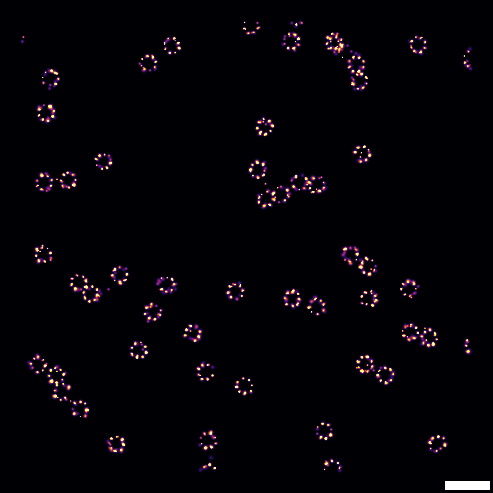

# SMLMAnalysis

[](https://JuliaSMLM.github.io/SMLMAnalysis.jl/stable/)
[](https://JuliaSMLM.github.io/SMLMAnalysis.jl/dev/)
[](https://github.com/JuliaSMLM/SMLMAnalysis.jl/actions/workflows/CI.yml?query=branch%3Amain)
[](https://codecov.io/gh/JuliaSMLM/SMLMAnalysis.jl)

SMLM analysis pipeline for the [JuliaSMLM](https://github.com/JuliaSMLM) ecosystem: detection, fitting, filtering, frame connection, drift correction, and super-resolution rendering with provenance tracking.

## Installation

```julia
using Pkg
Pkg.add("SMLMAnalysis")
```

## Quick Start

```julia
using SMLMAnalysis

cam = IdealCamera(512, 512, 0.1)  # 512x512, 100nm pixels

config = AnalysisConfig(
    camera = cam,
    steps = [
        DetectFitConfig(boxer=BoxerConfig(boxsize=9, psf_sigma=0.130),
            fitter=GaussMLEConfig(psf_model=GaussianXYNBS(), iterations=20)),
        FilterConfig(photons=(500.0, Inf), precision=(0.0, 0.007)),
        FrameConnectConfig(max_frame_gap=5),
        DriftConfig(degree=2, dataset_mode=:registered),
        RenderConfig(zoom=20, colormap=:inferno),
    ],
    outdir = "output/",
)
(result, info) = analyze(image_stacks, config)
```



## Loading Data

`image_stacks` above is your **raw camera data** — pixel intensities (ADU), not
localizations. It is one or more 3D arrays of shape `(height, width, frames)`, each
array being one *dataset* (a continuous acquisition). Pass a `Vector` of them for a
multi-dataset experiment, or a single 3D array for one:

```julia
image_stacks = [stack1, stack2]   # 2 datasets, each an (height, width, frames) array
image_stacks = stack              # 1 dataset — a single 3D array is also accepted
```

There are three ways to get it.

**1. Load an H5 file into memory.** The package ships loaders for two microscope
formats (both return `(height, width, frames)`):

```julia
# SMART — one continuous acquisition → one array, wrapped as a 1-element Vector:
stack, _ = smart_h5_to_array("data/experiment.h5")
(result, info) = analyze([stack], config)

# MIC (LidkeLab) — the file holds multiple blocks, each a separate dataset. Load them
# as separate stacks so the block boundaries are preserved (analyzing [stack] from
# load_mic_h5 would merge every block into one dataset):
n = load_mic_h5_info("data/experiment.h5").n_blocks
image_stacks = [load_mic_h5_block("data/experiment.h5", i) for i in 1:n]
(result, info) = analyze(image_stacks, config)
```

**2. Stream from files — no in-memory array.** Point `DetectFitConfig` at the
file(s) and call `analyze(config)` with no data argument. MIC blocks are
auto-detected as separate datasets. This is the memory-efficient path for large
acquisitions:

```julia
# For MIC files you can build the camera from the file's own calibration:
cam = build_camera_from_mic_h5("data/experiment.h5"; pixel_size=0.1)

config = AnalysisConfig(camera = cam, steps = [
    DetectFitConfig(path="data/experiment.h5", h5_format=:mic,
                    boxer=BoxerConfig(boxsize=9, psf_sigma=0.130)),
    FilterConfig(photons=(500.0, Inf)),
    RenderConfig(zoom=20),
])
(result, info) = analyze(config)      # each dataset is loaded from disk in turn
```

Multiple files, one dataset each: `DetectFitConfig(paths=["d1.h5", "d2.h5"], ...)`.

**3. Any other source.** Any `Array{<:Real,3}` of `(height, width, frames)` works —
a TIFF stack read with [TiffImages.jl](https://github.com/tlnagy/TiffImages.jl), or
simulated data from `SMLMSim` (`gen_images`). See
[`examples/loading_data.jl`](examples/loading_data.jl) for a runnable walkthrough of
all three, and the other [examples](examples/) for full simulated pipelines.

## Pipeline Architecture

The pipeline folds `analyze()` over a steps vector, with Julia's method dispatch routing each call by `(state_type, config_type)`:

```
for (i, cfg) in enumerate(steps)
    (state, step_info) = analyze(state, cfg)
end
```

Each step defines `analyze(input, ::MyConfig)` and returns `(result, StepInfo)`. Adding a step means defining a config type, implementing `analyze()` for it, and exporting -- it works immediately in both config-driven and step-by-step workflows.

Steps from upstream packages (`DriftConfig`, `FrameConnectConfig`, `RenderConfig`) are re-exported and dispatch directly to their source implementations.

## Step-by-Step Usage

Each step works standalone with the same `analyze()` dispatch:

```julia
cam = IdealCamera(512, 512, 0.1)

(smld, _) = analyze(image_stacks, DetectFitConfig(
    camera=cam, boxer=BoxerConfig(boxsize=9, psf_sigma=0.130)))
(smld, _) = analyze(smld, FilterConfig(photons=(500.0, Inf)))
(smld, _) = analyze(smld, FrameConnectConfig(max_frame_gap=5))
(smld, _) = analyze(smld, DriftConfig(degree=2))
(smld, _) = analyze(smld, RenderConfig(zoom=20, colormap=:inferno))  # writes an image when an outdir is set; use SMLMRender.render(smld, cfg) for the image in memory

# Save/load intermediate results
save_smld("checkpoint.h5", smld)
smld = load_smld("checkpoint.h5")
```

## Composability

After `DetectFitConfig` (which produces localizations from images), steps can be used in any combination, order, or repetition:

```julia
# Minimal: detect and render
steps = [DetectFitConfig(boxer=BoxerConfig(boxsize=9)), RenderConfig(zoom=20)]

# Multiple renders at different scales
steps = [DetectFitConfig(...), DriftConfig(degree=2),
         RenderConfig(zoom=10, colormap=:viridis),
         RenderConfig(zoom=20, colormap=:inferno)]

# Repeated filtering: coarse before connection, tight after
steps = [DetectFitConfig(...),
         FilterConfig(photons=(500.0, Inf)),
         FrameConnectConfig(max_frame_gap=5),
         FilterConfig(precision=(0.0, 0.005)),
         DriftConfig(degree=2),
         RenderConfig(zoom=20)]
```

## Multi-Dataset Workflows

Dataset boundaries are encoded in the data structure:

```julia
# Vector of arrays = multiple datasets
(result, info) = analyze([dataset1, dataset2, dataset3], config)

# Single array = one dataset
(result, info) = analyze(single_stack, config)

# File-based: MIC format auto-detects blocks as datasets
config = AnalysisConfig(
    camera = cam,
    steps = [DetectFitConfig(path="data.h5", h5_format=:mic), ...],
)
(result, info) = analyze(config)
```

## Multi-Target (Multi-Color)

Each channel runs its own `AnalysisConfig` pipeline, then cross-channel steps (alignment, composite rendering) run via `AbstractMultiTargetStep` dispatch:

```julia
mt = MultiTargetConfig(
    labels = [:IgG, :C1q],
    colors = [:cyan, :magenta],
    steps = [
        CompositeRenderConfig(zoom=20.0, strategy=GaussianRender()),
        CrossAlignConfig(method=:entropy),
        CompositeRenderConfig(zoom=20.0, strategy=GaussianRender()),
    ],
    outdir = "output/cell1/",
)

(result, info) = analyze([
    (images_647, config_647),
    (images_568, config_568),
], mt)

result[:IgG].smld    # Per-channel access
result.smlds         # All SMLDs
```

## Output and Provenance

Every `analyze()` call returns `(result, info)`:

| Field | Description |
|-------|-------------|
| `result.smld` | Final BasicSMLD with corrected localizations |
| `result.smld_connected` | Connected SMLD with track info |
| `result.drift_model` | Fitted drift model |
| `info.elapsed_s` | Total wall time |
| `info.steps[:detectfit]` | Typed info struct from upstream package |
| `info.step_infos` | Vector of StepInfos with per-step timing, config, and summary |

When `outdir` is set, each step writes to `outdir/01_detectfit/`, `outdir/02_filter/`, etc. with saved configs, summary stats, and diagnostic plots.

## JuliaSMLM Ecosystem

```
SMLMData (core types: Emitter, Camera, BasicSMLD)
    +-- SMLMBoxer (ROI detection)
    +-- GaussMLE (GPU-accelerated MLE fitting)
    +-- SMLMFrameConnection (linking across frames)
    +-- SMLMDriftCorrection (entropy-based drift correction)
    +-- SMLMRender (super-resolution rendering)
    +-- SMLMSim (simulation + image generation)
    +-- MicroscopePSFs (PSF models)
    +-- SMLMAnalysis (integrates all)
```

All packages share [SMLMData.jl](https://github.com/JuliaSMLM/SMLMData.jl) types. Coordinates are in microns throughout.

## AI Assistant Guide

If you use an AI coding assistant, `install_agent_guide()` writes a hierarchical,
version-stamped guide to the whole ecosystem — the `analyze()` pipeline plus the API
of every sub-package — assembled from the versions resolved in your environment:

```julia
using SMLMAnalysis
install_agent_guide()                      # Claude Code skill in ./.claude (gitignored by default)
install_agent_guide(track=true)            # …and committed, to share with the repo
install_agent_guide(tool=:codex)           # Codex AGENTS.md + reference bundle in this repo
install_agent_guide(scope=:user)           # install once for all your projects (~/.claude)
```

`tool` is `:claude` or `:codex`; `scope` is `:project` (this repo) or `:user` (your
home). At project scope the guide is added to `.gitignore` unless `track=true`.
Re-running refreshes it against your current package versions; `agent_guide_status()`
reports whether an install is stale, and `uninstall_agent_guide()` removes it (both act
only on guides this installer stamped).

## Documentation

- [Stable docs](https://JuliaSMLM.github.io/SMLMAnalysis.jl/stable/) - Full guide, configuration reference, and API
- [API Overview](api_overview.md) - LLM-parseable API reference

## License

MIT License - see [LICENSE](LICENSE) file.
