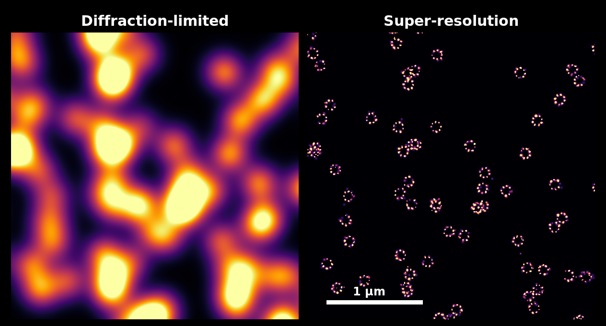
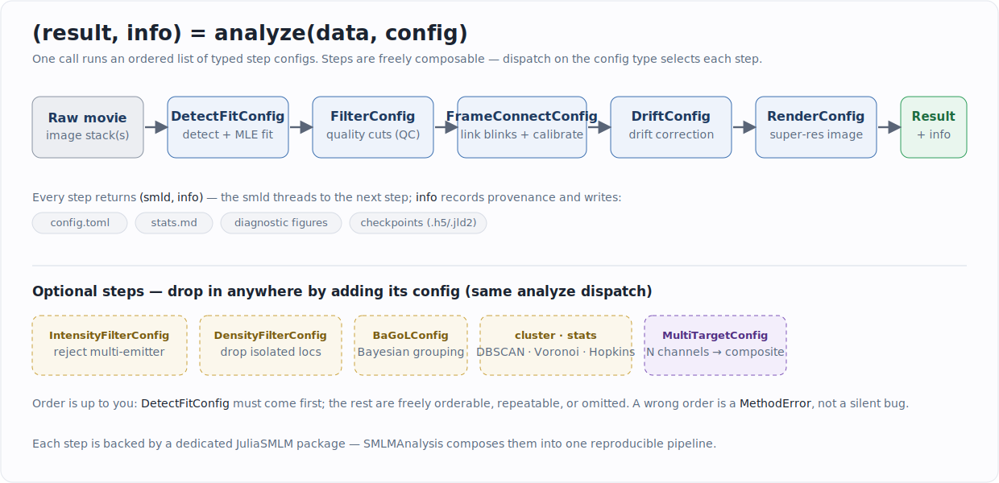

```@meta
CurrentModule = SMLMAnalysis
```

# SMLMAnalysis.jl



*The same single-molecule localizations rendered at the microscope's diffraction-limited resolution (left) and at the localization precision SMLMAnalysis achieves (right) — simulated 8-mer ring structures.*

**SMLMAnalysis is the entry point to the [JuliaSMLM](https://github.com/JuliaSMLM)
ecosystem.** It turns raw single-molecule localization microscopy (SMLM) movies
into super-resolution results by orchestrating the ecosystem's specialized
packages — detection, fitting, filtering, frame connection, drift correction,
rendering, Bayesian grouping, and clustering — behind one consistent interface:

```julia
(result, info) = analyze(data, config)
```

You describe *what* analysis you want as a list of typed step configs; the
package runs them in order, threads the data through, writes diagnostics and
provenance to disk, and hands back the final localizations plus a record of
everything that happened. Every step is backed by a dedicated, separately
documented JuliaSMLM package — SMLMAnalysis is the layer that composes them into
a reproducible pipeline.

## How it works



An SMLM pipeline is a sequence of transformations on a localization set. In
SMLMAnalysis each transformation is a **step**, configured by a typed struct
(`DetectFitConfig`, `FilterConfig`, `DriftConfig`, …). A pipeline is just an
ordered vector of those configs:

```julia
using SMLMAnalysis

config = AnalysisConfig(
    camera = cam,
    steps = [
        DetectFitConfig(boxer = BoxerConfig(boxsize = 9, psf_sigma = 0.130),
                        fitter = GaussMLEConfig(psf_model = GaussianXYNBS())),
        FilterConfig(photons = (500.0, Inf)),
        FrameConnectConfig(max_frame_gap = 5),
        DriftConfig(degree = 2),
        RenderConfig(zoom = 20, colormap = :inferno),
    ],
    outdir = "output/",
)

(result, info) = analyze(image_stacks, config)
result.smld          # final localizations (a SMLMData.BasicSMLD)
info.step_infos      # per-step history; stepinfo(info, :detectfit) looks one up by name
```

The same steps can be run one at a time for interactive exploration — every
`analyze(smld, cfg)` call returns a `(smld, info)` tuple you can inspect before
deciding the next step:

```julia
(smld, _) = analyze(image_stacks, DetectFitConfig(camera = cam,
                        boxer = BoxerConfig(boxsize = 9, psf_sigma = 0.130)))
(smld, _) = analyze(smld, FilterConfig(photons = (500.0, Inf)))
(smld, _) = analyze(smld, RenderConfig(zoom = 20, colormap = :inferno))  # render step is a pass-through
(img,  _) = render(smld, RenderConfig(zoom = 20, colormap = :inferno))   # get the image array directly
```

See **[The Pipeline Model](@ref)** for why this dispatch design makes steps
freely composable, and **[Pipeline Steps](@ref "Pipeline Steps: Overview")** for
the catalog of everything `analyze()` can do.

## Installation

Once SMLMAnalysis is registered in the Julia General registry:

```julia
using Pkg
Pkg.add("SMLMAnalysis")
```

Until then (and for development against the local ecosystem), see
**[Installation & Setup](@ref)** for the current install path.

## The ecosystem

```
SMLMData (core types)
    |
    +-- SMLMBoxer ............ ROI detection
    +-- GaussMLE ............. GPU-accelerated MLE fitting
    +-- SMLMFrameConnection .. linking blinks + uncertainty calibration
    +-- SMLMDriftCorrection .. fiducial-free drift correction
    +-- SMLMRender ........... super-resolution rendering
    +-- SMLMBaGoL ............ Bayesian grouping of localizations
    +-- SMLMClustering ....... DBSCAN / Hierarchical / Voronoi / Hopkins
    +-- SMLMSim .............. simulation + image generation
    +-- MicroscopePSFs ....... PSF models
    |
    +-- SMLMAnalysis ......... integrates all of the above
```

SMLMAnalysis depends on each of these and exposes their key types directly (so
`using SMLMAnalysis` is usually all you need). It also adds **several analysis
steps of its own** — quality filtering, intensity-based multi-emitter rejection,
density filtering, and multi-channel composite rendering / cross-alignment /
cross-correlation — that do not live in any single upstream package. See
**[The JuliaSMLM Ecosystem](@ref)** for who does what and when to reach for a
package directly.

## Where to go next

- **Run it now** → [Getting Started](@ref Tutorial) — a full pipeline with figures at
  every step.
- **Understand the design** → [Concepts](@ref "Concepts: Overview") — the
  pipeline model, the ecosystem map, and the data model.
- **Day-to-day tasks** → [Workflows](@ref "Installation & Setup") — installing,
  running, multi-dataset and multi-channel acquisitions, I/O and resume, and
  adding your own step.
- **Per-step reference** → [Pipeline Steps](@ref "Pipeline Steps: Overview") —
  one page per `analyze()` step, each with its primary literature.

```@index
```
