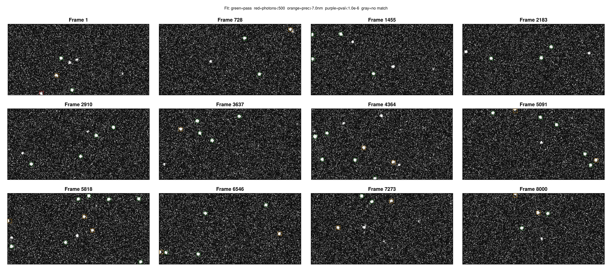

# [Tutorial](@id Tutorial)

This walkthrough runs a complete SMLM analysis pipeline on simulated data, showing the output at every step. All figures are generated from the `examples/analysis_example.jl` and `examples/stepwise_example.jl` scripts.

## Setup

```julia
using SMLMAnalysis
using MicroscopePSFs

# Camera: 256x128 pixels @ 100nm
camera = IdealCamera(256, 128, 0.1)

# Simulate: 4 datasets x 2000 frames, 8-mer pattern
sim_params = StaticSMLMConfig(density=2.0, sigma_psf=0.13, nframes=2000, ndatasets=4)
pattern = Nmer2D(n=8, d=0.05)
fluor = GenericFluor(photons=50000.0, k_off=20.0, k_on=0.02)

(_, sim_info) = simulate(sim_params; pattern=pattern, molecule=fluor, camera=camera)
```

Image generation uses `gen_images` from SMLMSim with a Gaussian PSF model. See the example scripts for the full setup including the per-dataset image generation workaround.

## AnalysisConfig Approach

The primary interface uses `AnalysisConfig` to define a complete pipeline:

```julia
config = AnalysisConfig(
    camera = camera,
    steps = [
        DetectFitConfig(boxsize=7, psf_sigma=0.13, psf_model=:variable),
        FilterConfig(photons=(500.0, Inf), precision=(0.0, 0.007), pvalue=(1e-3, 1.0)),
        FrameConnectConfig(max_frame_gap=5),
        DriftCorrectConfig(degree=2),
        DensityFilterConfig(n_sigma=2.0),
        RenderConfig(zoom=20, colormap=:inferno),
    ],
    outdir = "output/",
    verbose = Verbosity.STANDARD
)

# image_stacks is Vector{Array}: 4 datasets, each (height, width, 2000)
(result, info) = analyze(image_stacks, config)
```

The `analyze` function returns `(AnalysisResult, AnalysisInfo)` following the JuliaSMLM tuple-pattern. Each step produces diagnostic outputs in the output directory.

## Step 1: Detection + Fitting

`DetectFitConfig` combines ROI detection (SMLMBoxer) and MLE fitting (GaussMLE) into a single step. For multi-dataset data (Vector{Array}), each dataset is processed independently.

```julia
DetectFitConfig(
    boxsize = 7,          # ROI size in pixels
    min_photons = 500.0,  # Detection threshold
    psf_sigma = 0.13,     # Expected PSF width (um)
    psf_model = :variable, # :fixed, :variable, or :anisotropic
)
```

Dataset boundaries come from the data structure: `Vector{Array}` of length 4 = 4 datasets.

### Detection overlay

Shows detected ROIs overlaid on raw camera frames. Yellow boxes mark each candidate molecule:


### Fit overlay

Boxes colored by fit quality -- green passes all filters, red fails photon threshold, orange fails precision, purple fails p-value:



### Fit quality distributions

Histograms of photons, background, localization precision, p-value, and PSF width. Gray regions show what would be rejected by the specified filter thresholds:


## Step 2: Filtering

`FilterConfig` applies quality-based filtering. All criteria use `(min, max)` tuples:

```julia
FilterConfig(
    photons = (500.0, Inf),      # Minimum 500 photons
    precision = (0.0, 0.007),    # Maximum 7nm precision
    pvalue = (1e-3, 1.0),       # Goodness-of-fit threshold
    psf_sigma = :auto            # Optional: mode +/- 10%
)
```

The acceptance rate (typically 60-90% for well-optimized detection) is reported in the step summary.

## Step 3: Frame Connection

`FrameConnectConfig` links localizations of the same emitter across consecutive frames. This step also performs uncertainty calibration, comparing reported CRLB uncertainties against observed frame-to-frame scatter.

```julia
FrameConnectConfig(
    max_frame_gap = 5,      # Allow gaps of up to 5 dark frames
    max_sigma_dist = 5.0,   # Spatial matching threshold
    calibrate = true,     # Run uncertainty calibration
    clamp_k_to_one = true # Don't allow k < 1 (CRLB is theoretical lower bound)
)
```

### Track size distribution

Shows the number of localizations per track. The mean track length reflects blinking kinetics (k_off):


### Uncertainty calibration

Compares reported variance (CRLB) against observed variance from frame-to-frame scatter. The fit gives `A` (motion variance in nm^2) and `B` (CRLB scale factor):


### Drift jitter

Frame-to-frame position shifts estimated from linked emitters. Shows both instantaneous jitter and cumulative drift across all datasets:


## Step 4: Drift Correction

`DriftCorrectConfig` corrects sample drift using entropy-based optimization from SMLMDriftCorrection.

```julia
DriftCorrectConfig(
    degree = 2,            # Polynomial degree
    continuous = false,    # Registered mode (multi-dataset)
    quality = :singlepass  # :singlepass or :iterative
)
```

### Drift trajectory

Shows the estimated X and Y drift over time and the XY path. For multi-dataset data, each dataset's trajectory is shown in a different color:


For details on continuous vs registered modes and chunking strategies, see the [Guide](@ref).

## Step 5: Density Filter

`DensityFilterConfig` removes isolated localizations that lack neighbors, which are likely false detections.

```julia
DensityFilterConfig(
    n_sigma = 2.0,           # Search radius in sigma units
    min_neighbors = :auto    # Auto-detect threshold via valley method
)
```

### Neighbor histogram

The valley between the isolated peak (low neighbors) and the clustered peak (high neighbors) determines the threshold:


## Step 6: Render

`RenderConfig` generates super-resolution images using SMLMRender. Multiple renders can be added as separate pipeline steps.

```julia
# Gaussian blur rendering (publication quality)
RenderConfig(zoom=20, colormap=:inferno)

# Histogram binning colored by time
RenderConfig(strategy=HistogramRender(), zoom=10, colormap=:turbo, color_by=:absolute_frame)

# Circle rendering colored by time
RenderConfig(strategy=CircleRender(), zoom=50, colormap=:turbo, color_by=:absolute_frame)
```

### Gaussian render


### Histogram render


### Circle render


## Step 7: BaGoL (Optional)

`BaGoLConfig` performs Bayesian Grouping of Localizations, estimating the true number and positions of emitters from repeated localizations.

```julia
BaGoLConfig(
    n_iterations = 10000,     # MCMC iterations
    burn_in = 2000,           # Burn-in before recording
    partition_threshold = 500, # Partition large datasets
    render_zoom = 50          # High zoom for grouped emitters
)
```

BaGoL produces:
- **Overlay plot**: Input localizations (gray ellipses) vs grouped emitters (red ellipses)
- **Gaussian render**: Super-resolution image from grouped emitter positions
- **K posterior**: Posterior distribution P(K|data) over the number of emitters

## Step-by-Step Workflow

The pure step functions enable iterative parameter tuning:

```julia
# Run detection + fitting (expensive step)
(smld, df_info) = detectfit(image_stacks, camera, DetectFitConfig(boxsize=7);
    outdir="output/", step_number=1, verbose=Verbosity.STANDARD)
smld_raw = df_info.smld_raw

# Save for later resume
save_smld("output/after_detectfit.h5", smld)

# Try filter parameters
(smld_filtered, _) = filter_step(smld, FilterConfig(photons=(500.0, Inf));
    smld_raw=smld_raw, outdir="output/", step_number=2, verbose=Verbosity.STANDARD)

# Not happy? Try looser filter on same smld (no re-detection needed)
(smld_filtered, _) = filter_step(smld, FilterConfig(photons=(300.0, Inf));
    smld_raw=smld_raw)

# Continue pipeline
(smld_fc, fc_info) = frameconnect_step(smld_filtered, FrameConnectConfig(max_frame_gap=5))
(smld_dc, dc_info) = driftcorrect_step(smld_fc, DriftCorrectConfig(degree=2))
(img, _) = render_step(smld_dc, RenderConfig(zoom=20, colormap=:inferno))

# Resume from saved checkpoint in new session
smld = load_smld("output/after_detectfit.h5")
(smld, _) = filter_step(smld, FilterConfig(photons=(400.0, Inf)))
```

## Output Directory Structure

When `outdir` is set, each step writes to a numbered subdirectory:

```
output/
├── 01_detectfit/
│   ├── config.toml
│   ├── info.toml
│   ├── stats.md
│   ├── fit_quality.png
│   ├── detection_overlay.png
│   └── fit_overlay.png
├── 02_filter/
│   ├── config.toml
│   └── stats.md
├── 03_frameconnect/
│   ├── config.toml
│   ├── info.toml
│   ├── stats.md
│   ├── track_histogram.png
│   ├── uncertainty_calibration.png
│   └── drift_jitter.png
├── 04_driftcorrect/
│   ├── config.toml
│   ├── info.toml
│   ├── stats.md
│   └── drift_trajectory.png
├── 05_densityfilter/
│   ├── config.toml
│   ├── stats.md
│   └── neighbor_histogram.png
├── 06_render/
│   ├── config.toml
│   ├── info.toml
│   └── gaussianrender_inferno_20x.png
└── summary.md
```
