# [Tutorial](@id Tutorial)

This walkthrough runs a complete SMLM analysis pipeline on simulated data, showing the output at every step. All figures are generated from the scripts in `examples/` — the core walkthrough uses `analysis_example.jl` and `stepwise_example.jl`; the [Bayesian Grouping (BaGoL)](@ref tutorial-bagol) and [Multi-Target (Multi-Color)](@ref tutorial-multitarget) sections below use `bagol_example.jl` and `multicolor_example.jl`.

## Setup

```julia
using SMLMAnalysis
using MicroscopePSFs

# Camera: 256x128 pixels @ 100nm
camera = IdealCamera(256, 128, 0.1)

# Simulate: 4 datasets x 2000 frames, 8-mer pattern
sim_params = StaticSMLMConfig(density=2.0, σ_psf=0.13, nframes=2000, ndatasets=4)
pattern = Nmer2D(n=8, d=0.05)
fluor = GenericFluor(photons=50000.0, k_off=20.0, k_on=0.02)

(_, sim_info) = simulate(sim_params; pattern=pattern, molecule=fluor, camera=camera)
```

Image generation uses `gen_images` from SMLMSim with a Gaussian PSF model. See the example scripts for the full setup including the per-dataset image generation workaround.

## AnalysisConfig Approach

The primary interface uses `AnalysisConfig` to define a complete pipeline:

```julia
config = AnalysisConfig(
    camera = camera,
    steps = [
        DetectFitConfig(
            boxer=BoxerConfig(boxsize=7, psf_sigma=0.13),
            fitter=GaussMLEConfig(psf_model=GaussianXYNBS(), iterations=20)),
        FilterConfig(photons=(500.0, Inf), precision=(0.0, 0.007), pvalue=(1e-3, 1.0)),
        FrameConnectConfig(max_frame_gap=5, calibration=CalibrationConfig(clamp_k_to_one=true)),
        DriftConfig(degree=2),
        DensityFilterConfig(n_sigma=2.0),
        RenderConfig(zoom=20, colormap=:inferno),
    ],
    outdir = "output/",
    verbose = Verbosity.STANDARD
)

# image_stacks is Vector{Array}: 4 datasets, each (height, width, 2000)
(result, info) = analyze(image_stacks, config)
```

The `analyze` function returns `(AnalysisResult, AnalysisInfo)` following the JuliaSMLM tuple-pattern. Each step produces diagnostic outputs in the output directory.

## Step 1: Detection + Fitting

`DetectFitConfig` combines ROI detection (SMLMBoxer) and MLE fitting (GaussMLE) into a single step. For multi-dataset data (Vector{Array}), each dataset is processed independently.

```julia
DetectFitConfig(
    boxer = BoxerConfig(boxsize=7, min_photons=500.0, psf_sigma=0.13),
    fitter = GaussMLEConfig(psf_model=GaussianXYNBS(), iterations=20),
)
```

Dataset boundaries come from the data structure: `Vector{Array}` of length 4 = 4 datasets.

### Detection overlay

Shows detected ROIs overlaid on raw camera frames. Yellow boxes mark each candidate molecule:

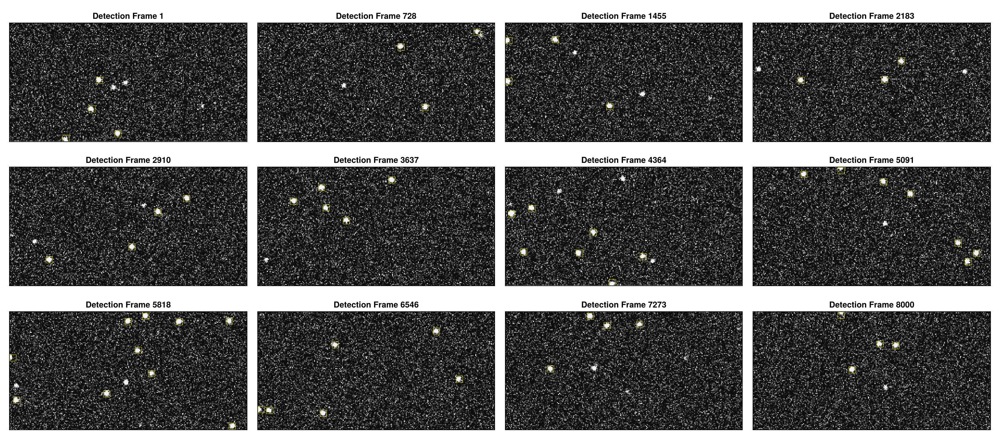

### Fit quality distributions

Generated by the filter step: histograms of photons, background, localization precision, p-value, and PSF width from the raw (pre-filter) data. Gray regions show what will be rejected by the filter thresholds:

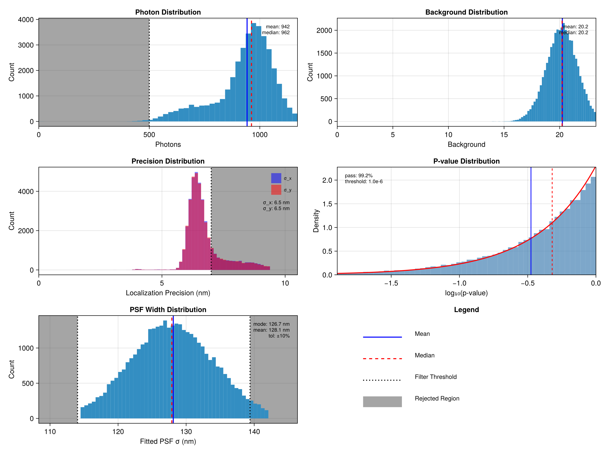

## Step 2: Filtering

`FilterConfig` applies quality-based filtering. All criteria use `(min, max)` tuples:

```julia
FilterConfig(
    photons = (500.0, Inf),      # Minimum 500 photons
    precision = (0.0, 0.007),    # Maximum 7nm precision
    pvalue = (1e-3, 1.0),       # Goodness-of-fit threshold
    psf_sigma = :auto            # Optional: mode +/- 10%
)
```

The acceptance rate (typically 60-90% for well-optimized detection) is reported in the step summary.

## Step 3: Frame Connection (with uncertainty calibration)

`FrameConnectConfig` links localizations of the same emitter across consecutive frames. Uncertainty calibration is integrated as a sub-config via the `calibration` field — when set, the linked tracks are used to fit the CRLB-vs-observed-variance model before the per-track combine step (link → calibrate → combine).

```julia
FrameConnectConfig(
    max_frame_gap = 5,                                  # Allow gaps of up to 5 dark frames
    max_sigma_dist = 5.0,                               # Spatial matching threshold
    calibration = CalibrationConfig(clamp_k_to_one=true),  # k >= 1 (CRLB is theoretical lower bound)
)
```

The calibration fits `observed_variance = A + B * CRLB_variance`, giving `sigma_motion = sqrt(A)` (extra motion/jitter variance) and `k = sqrt(B)` (CRLB scale factor). After calibration, each emitter's uncertainty is corrected to `sqrt(sigma_motion^2 + k^2 * sigma_CRLB^2)` and tracks are recombined with weighted averaging using corrected uncertainties.

Calibration results are available on the returned info:

```julia
(smld, fc_info) = analyze(smld, FrameConnectConfig(max_frame_gap=5,
    calibration=CalibrationConfig(clamp_k_to_one=true)))

cal = fc_info.info.calibration   # FrameConnectInfo.calibration::CalibrationResult
cal.k_scale                       # k
cal.sigma_motion_nm               # sqrt(A) in nm
cal.mean_chi2                     # ~2.0 means well-calibrated
```

### Track size distribution

Shows the number of localizations per track. The mean track length reflects blinking kinetics (k_off):

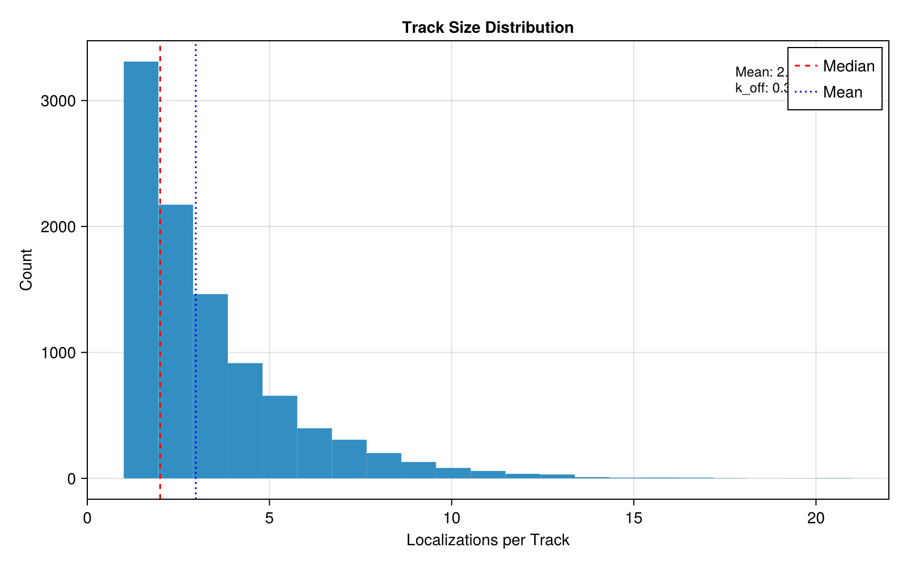

### Drift jitter

Frame-to-frame position shifts estimated from linked emitters. Shows both instantaneous jitter and cumulative drift across all datasets:

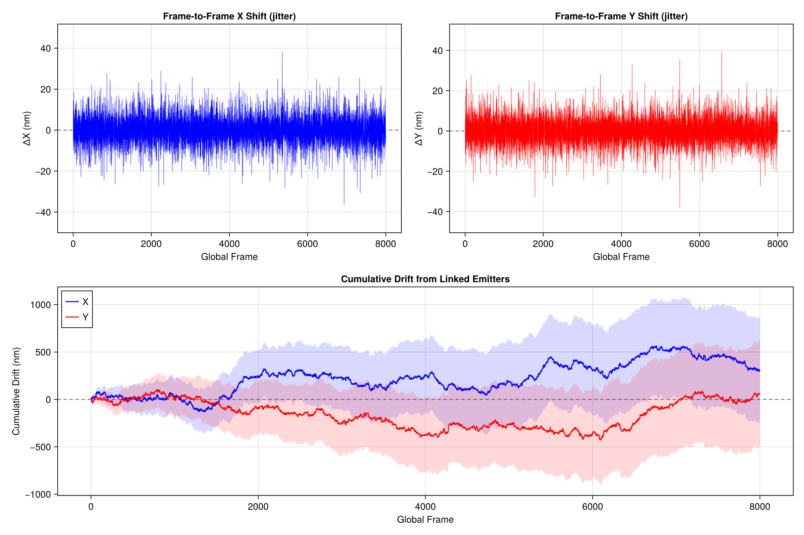

### Uncertainty calibration

Compares reported variance (CRLB) against observed variance from frame-to-frame scatter. The fit gives `A` (motion variance in nm^2) and `B` (CRLB scale factor):

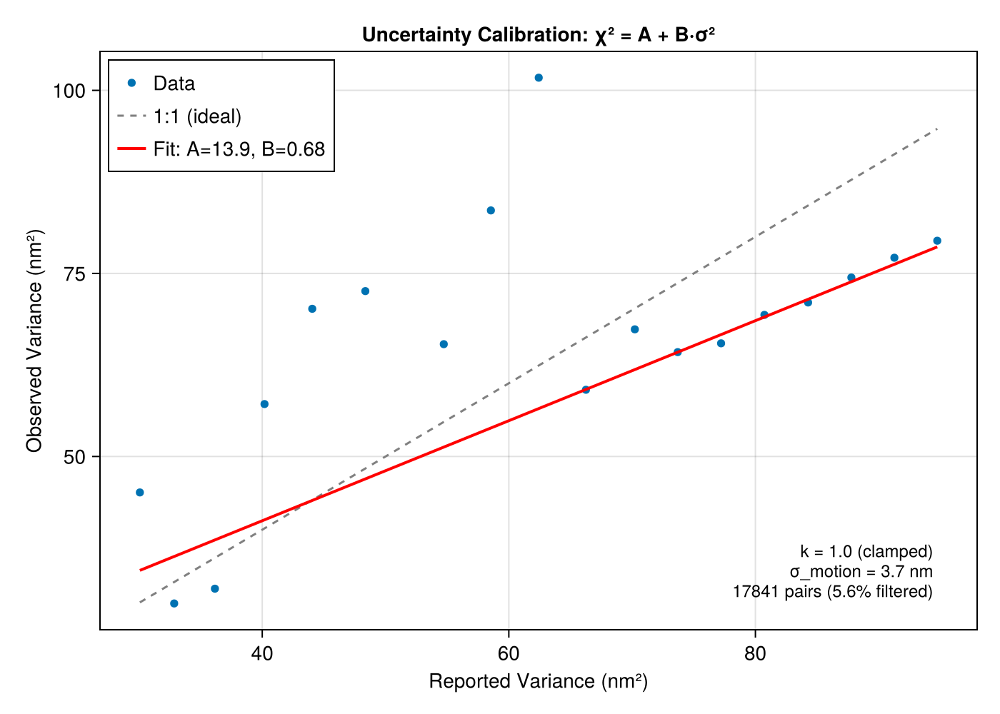

## Step 4: Drift Correction

`DriftConfig` corrects sample drift using entropy-based optimization from SMLMDriftCorrection.

```julia
DriftConfig(
    degree = 2,                  # Polynomial degree
    dataset_mode = :registered,  # Registered mode (multi-dataset)
    quality = :singlepass        # :singlepass or :iterative
)
```

### Drift trajectory

Shows the estimated X and Y drift over time and the XY path. For multi-dataset data, each dataset's trajectory is shown in a different color:

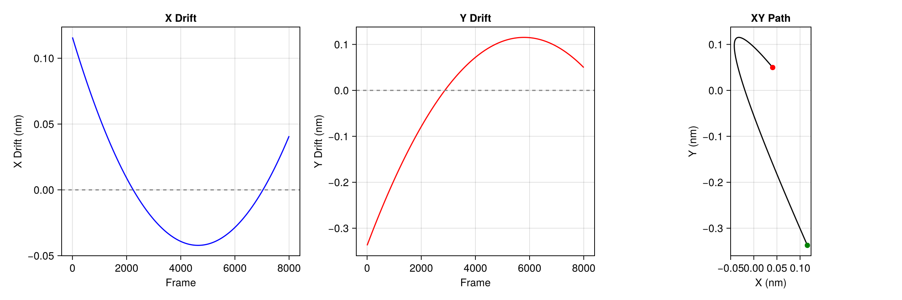

For details on continuous vs registered modes and chunking strategies, see [Drift Correction](@ref).

## Step 5: Density Filter

`DensityFilterConfig` removes isolated localizations that lack neighbors, which are likely false detections.

```julia
DensityFilterConfig(
    n_sigma = 2.0,           # Search radius in sigma units
    min_neighbors = :auto    # Auto-detect threshold via valley method
)
```

### Neighbor histogram

The valley between the isolated peak (low neighbors) and the clustered peak (high neighbors) determines the threshold:

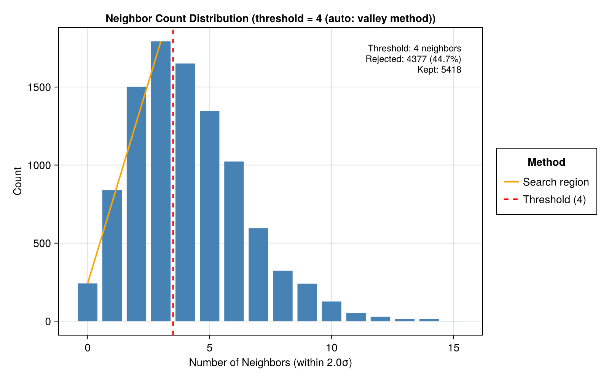

## Step 6: Render

`RenderConfig` generates super-resolution images using SMLMRender. Multiple renders can be added as separate pipeline steps.

```julia
# Gaussian blur rendering (publication quality)
RenderConfig(zoom=20, colormap=:inferno)

# Histogram binning colored by time
RenderConfig(strategy=HistogramRender(), zoom=10, colormap=:turbo, color_by=:absolute_frame, clip_percentile=nothing)

# Circle rendering colored by time
RenderConfig(strategy=CircleRender(), zoom=50, colormap=:turbo, color_by=:absolute_frame)
```

### Gaussian render


### Histogram render

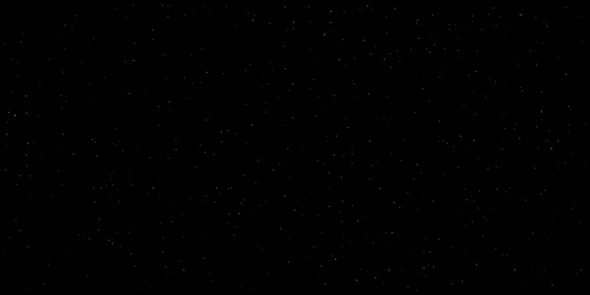

### Circle render


## Step-by-Step Workflow

The `analyze()` dispatch enables iterative parameter tuning:

```julia
# Run detection + fitting (expensive step)
(smld, df_info) = analyze(image_stacks, DetectFitConfig(
    camera=camera, boxer=BoxerConfig(boxsize=7, psf_sigma=0.13));
    outdir="output/", step_number=1, verbose=Verbosity.STANDARD)

# Save for later resume
save_smld("output/after_detectfit.h5", smld)

# Try filter parameters
(smld_filtered, _) = analyze(smld, FilterConfig(photons=(500.0, Inf));
    outdir="output/", step_number=2, verbose=Verbosity.STANDARD)

# Not happy? Try looser filter on same smld (no re-detection needed)
(smld_filtered, _) = analyze(smld, FilterConfig(photons=(300.0, Inf)))

# Continue pipeline (calibration is a sub-config of FrameConnectConfig)
(smld_fc, fc_info) = analyze(smld_filtered, FrameConnectConfig(max_frame_gap=5,
    calibration=CalibrationConfig(clamp_k_to_one=true)))
cal = fc_info.info.calibration   # CalibrationResult
(smld_dc, dc_info) = analyze(smld_fc, DriftConfig(degree=2))
(smld_dc, _) = analyze(smld_dc, RenderConfig(zoom=20, colormap=:inferno))  # pass-through; writes image to outdir
(img, _) = render(smld_dc, RenderConfig(zoom=20, colormap=:inferno))       # in-memory image array

# Resume from saved checkpoint in new session
smld = load_smld("output/after_detectfit.h5")
(smld, _) = analyze(smld, FilterConfig(photons=(400.0, Inf)))
```

## Output Directory Structure

When `outdir` is set, each step writes to a numbered subdirectory:

```
output/
├── 01_detectfit/
│   ├── config.toml
│   ├── info.toml
│   ├── stats.md
│   └── detection_overlay.png
├── 02_filter/
│   ├── config.toml
│   ├── stats.md
│   ├── fit_quality.png
│   └── fit_overlay.png
├── 03_frameconnect/
│   ├── config.toml
│   ├── info.toml
│   ├── stats.md
│   ├── track_histogram.png
│   ├── drift_jitter.png
│   ├── shift_histogram.png
│   └── uncertainty_calibration.png   # when calibration=CalibrationConfig()
├── 04_driftcorrect/
│   ├── config.toml
│   ├── info.toml
│   ├── stats.md
│   └── drift_trajectory.png
├── 05_densityfilter/
│   ├── config.toml
│   ├── info.toml
│   ├── stats.md
│   └── neighbor_histogram.png
├── 06_render/
│   ├── config.toml
│   ├── info.toml
│   └── gaussianrender_inferno_20x.png
└── summary.md
```

## [Bayesian Grouping (BaGoL)](@id tutorial-bagol)

When each emitter blinks or rebinds many times — as in DNA-PAINT, or dSTORM with long acquisitions — every binding site produces a *cloud* of localizations. **BaGoL** (Bayesian Grouping of Localizations) groups that cloud into a single high-precision emitter using reversible-jump MCMC. It runs after frame connection (and any filtering), before the final render.

The `examples/bagol_example.jl` script simulates a DNA-PAINT hexamer — 6 binding sites on a 40 nm circle — producing ~10 localizations per site over 4000 frames. The BaGoL step is a single `analyze()` call whose fields pass straight through to `SMLMBaGoL.run_bagol`:

```julia
(smld_bagol, step_info) = analyze(smld, BaGoLConfig(
    μ = 10.0,                     # Expected localizations per binding site
    shape = 2.0,                  # NegBin shape (1 = dSTORM, >1 = DNA-PAINT)
    learn_distribution = true,    # Let the MCMC refine μ and shape
    n_iterations = 10000,
    burn_in = 2000,
    partition_sigma = 3.0,        # DBSCAN pre-partition threshold (σ units)
    posterior_pixel_size = 0.002, # 2 nm posterior image (0.0 to disable)
))

bagol = step_info.info
bagol.n_emitters    # number of grouped emitters (MAP-N)
bagol.compression   # localizations-to-emitters ratio
bagol.final_μ       # refined mean localizations per emitter
```

BaGoL is state-modifying: `smld_bagol` replaces `smld` for any downstream render. Its diagnostics are written to the step folder (`08_bagol/`) — the 2 nm posterior image, partition circles, the localization-vs-MAP-N overlay, and MCMC acceptance rates — using SMLMBaGoL's own report system rather than inline rendering.

### Count distribution

The grouping fits a negative-binomial model to the number of localizations per emitter. The recovered `μ` and shape `α` summarize the blinking/rebinding kinetics:

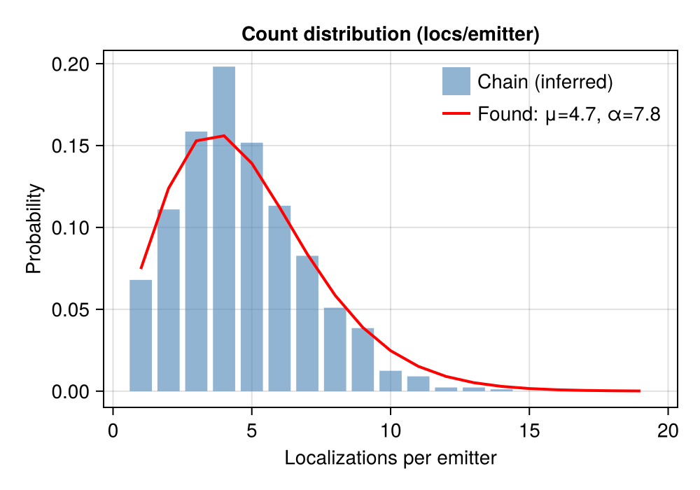

### Nearest-neighbor distances

After grouping, the distances between neighboring MAP-N emitters recover the underlying geometry — here the ~19 nm edge spacing of the simulated hexamer:

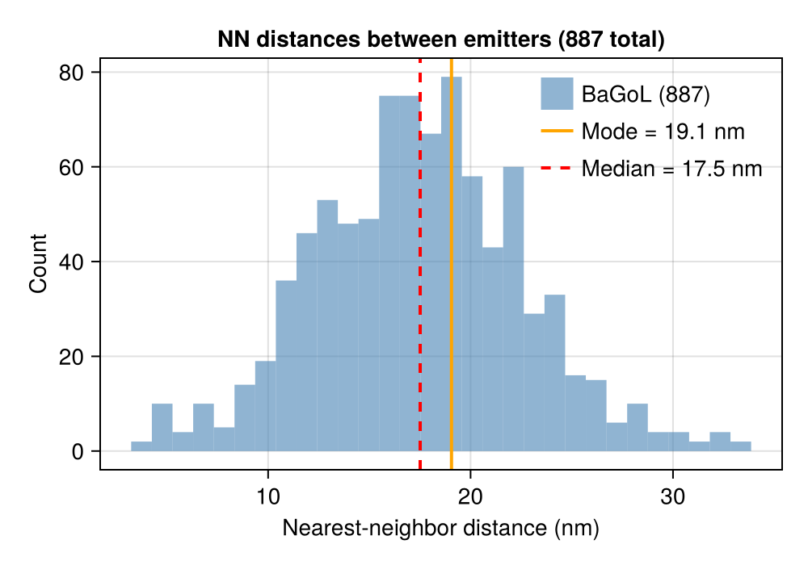

Super-resolution rendering of the grouped emitters is done with a subsequent `RenderConfig` step (precision-weighted Gaussian). For the full field reference — partitioning, the count model, learned vs. fixed distributions — see [Bayesian Grouping (BaGoL)](@ref).

## [Multi-Target (Multi-Color)](@id tutorial-multitarget)

To analyze multiple color channels and overlay them, run each channel through its own `AnalysisConfig`, then tie them together with a `MultiTargetConfig`. The multi-target steps (composite render, cross-alignment, cross-correlation) dispatch on the resulting `Vector{BasicSMLD}`.

`examples/multicolor_example.jl` analyzes two channels — `Nmer2D` clusters and `Line2D` filaments — each with a full DetectFit → Filter → FrameConnect → Drift → Render pipeline, then composites them:

```julia
mt = MultiTargetConfig(
    labels = [:clusters, :lines],
    colors = [:cyan, :magenta],   # default for 2 channels
    steps = [
        CompositeRenderConfig(zoom=20.0, strategy=GaussianRender()),
        CrossCorrConfig(r_max=0.5, dr=0.005),
    ],
    outdir = "output/multicolor/",
)

(result, info) = analyze([
    (image_stacks_clusters, config_clusters),
    (image_stacks_lines,    config_lines),
], mt)

result[:clusters].smld     # per-channel SMLD
result.smlds               # Vector{BasicSMLD} (all channels, possibly aligned)
info.channels[:clusters]   # per-channel AnalysisInfo
```

### Composite render

`CompositeRenderConfig` renders each channel in its assigned color and overlays them — cyan clusters over magenta filaments:

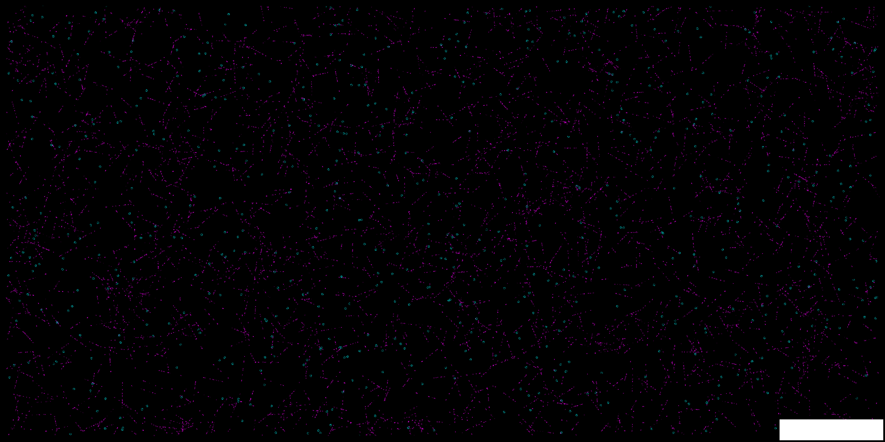

### Cross-correlation

`CrossCorrConfig` computes the pair cross-correlation g(r) between two channels. A peak above the complete-spatial-randomness baseline (g = 1) at short range indicates co-localization:

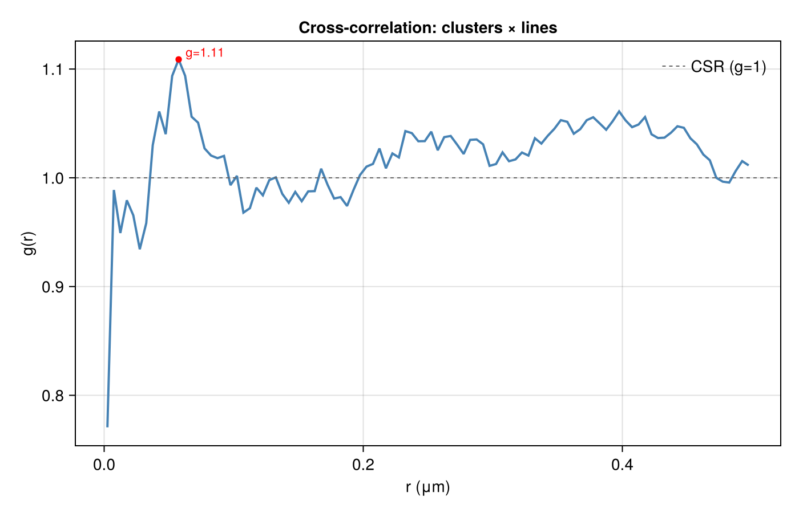

For per-channel output layout, cross-alignment, and the full step reference, see [Multi-Channel Analysis](@ref).
